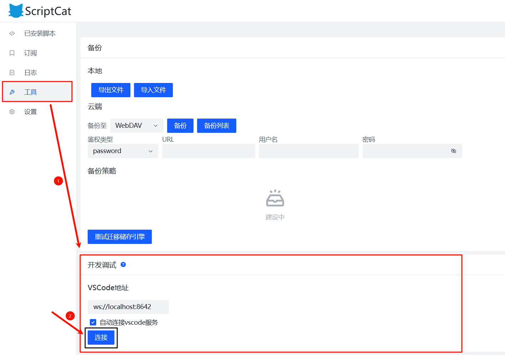

# Vite Plugin ScriptCat Script Push

[English](./README.md) / 中文

## 功能

在开发过程中通过 WebSocket 自动将重建的 JavaScript 包推送到 ScriptCat 扩展。无需手动重新加载或重新安装即可实现脚本的即时更新。

> 更新后的脚本仍需刷新页面才能重新加载到页面中。

## 安装

```bash
npm install @yiero/vite-plugin-scriptcat-script-push -D
# or
yarn add @yiero/vite-plugin-scriptcat-script-push -D
# or
pnpm add @yiero/vite-plugin-scriptcat-script-push -D
```

## 配置

| 参数    | 类型     | 描述                             | 默认值    |
| ------- | -------- | -------------------------------- | --------- |
| `port`  | `number` | WebSocket 服务器的端口号         | `8642`    |
| `match` | `RegExp` | 用于匹配要广播的文件的正则表达式 | `/\.js$/` |

## 使用

> **注意**: 同一时间只能开启一个 ws 服务器. 

### 安装插件

在 `vite.config.js` / `vite.config.ts` 中添加插件：

**基础使用**

```ts
import { defineConfig } from 'vite'
import scriptPushPlugin from '@yiero/vite-plugin-scriptcat-script-push'

export default defineConfig({
  plugins: [
    // 其他插件...
    
    // 自动将重建的脚本推送到 ScriptCat
    scriptPushPlugin()
  ],
})
```

**进阶使用**

```ts
import { defineConfig } from 'vite'
import scriptPushPlugin from '@yiero/vite-plugin-scriptcat-script-push'

export default defineConfig({
  plugins: [
    // 在自定义端口上推送 .user.js 后缀的文件
    scriptPushPlugin({
      // 自定义端口
      port: 8642,
      // 自定义要推送的脚本后缀
      match: /\.user\.js$/
    })
  ],
})
```

---

### 连接服务器

1. 打开 *浏览器* - 脚本猫 *脚本列表* 界面
2. 点击左侧 *工具* 菜单栏
3. 找到 *开发调试* 一栏
4. 找到 *VSCode地址* , 点击下方的按钮 ***连接*** 
5. 如果使用自定义端口, 请修改 `ws://localhost:8642` 的值为对应的端口号: `ws://localhost:<port>` . 



---

### 开发脚本

1. 使用 `watch` 模式构建脚本: `vite build --watch` . 

> 如果脚本成功安装, 会在 `watching for file changes...` 下面提示 ws 服务器开启: 

```bash
watching for file changes...
[ScriptCat] WS server started on port 8642
```

> 同时, 将已经打包完成的脚本进行缓存, 等待客户端连接. 

```bash
build started...
✓ 1 modules transformed.
[ScriptCat] cache script: <本地文件地址>
```

2. 按照 [连接服务器](#连接服务器) 的步骤，连接 ws 客户端。

> 如果脚本猫连接 ws 服务器成功，会在终端提示: 

```bash
 [ScriptCat] client-1 connected
```

> 同时, 将缓存的脚本推送到连接的客户端. 

```bash
[ScriptCat] broadcast to client-1: <本地文件地址>
```

3. 当你修改脚本源文件时，触发 vite 重建流程，插件将自动将打包完成的脚本推送到所有已连接的客户端。

> 如果脚本广播成功，会在终端提示: 

```bash
[ScriptCat] broadcast to client-1: <本地文件地址>
```

## 工作原理

插件会自动执行以下操作：

1. 在 Vite 构建期间在指定端口上创建 WebSocket 服务器
2. 在启动服务器前检查端口是否可用
3. 与所有活跃客户端保持连接
4. 脚本缓存机制：
   - 以 `{uri: script}` 结构缓存所有匹配的脚本
   - 缓存在 WebSocket 服务器生命周期内持续存在
   - 无客户端连接时，脚本仅缓存不广播
   - 客户端连接时，广播所有已缓存的脚本
5. 当 Vite 重建并写入 bundle 时：
   - 根据匹配模式过滤文件
   - 将文件路径转换为正确的 URL
   - 将更新的脚本内容广播到所有已连接的客户端（或缓存，若无客户端）
6. 每 30 秒发送一次 ping 消息以保持连接活跃

## 贡献指南

请通过 [GitHub](https://github.com/AliubYiero/vite-plugin-scriptcat-script-push) 提交 issue 或 PR。

## 许可证

GPL-3 © [AliubYiero](https://github.com/AliubYiero)

