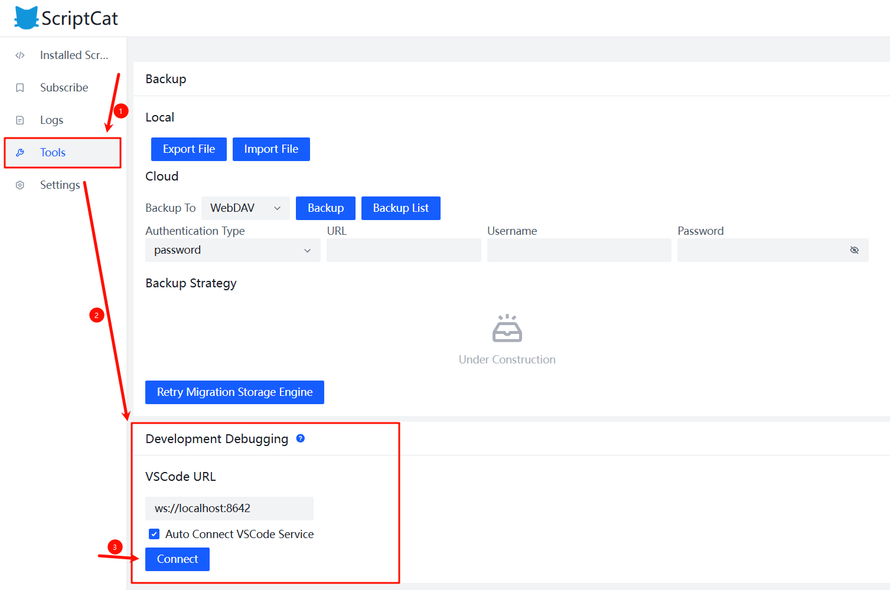

# Vite Plugin ScriptCat Script Push

English / [中文](./README-zh.md)

## Features

Automatically pushes rebuilt JavaScript bundles to the ScriptCat extension via WebSocket during development. Enables instant script updates without manual reloading or reinstallation.

> Updated scripts still require a page refresh to be reloaded into the page.

## Installation

```bash
npm install @yiero/vite-plugin-scriptcat-script-push -D
# or
yarn add @yiero/vite-plugin-scriptcat-script-push -D
# or
pnpm add @yiero/vite-plugin-scriptcat-script-push -D
```

## Configuration

| Parameter | Type     | Description                                   | Default   |
| --------- | -------- | --------------------------------------------- | --------- |
| `port`    | `number` | Port number for the WebSocket server          | `8642`    |
| `match`   | `RegExp` | Regex pattern to match files for broadcasting | `/\.js$/` |

## Usage

> **Note**: Only one WS server can be active at a time.

### Install the Plugin

Add the plugin to `vite.config.js` / `vite.config.ts`:

**Basic Usage**

```ts
import { defineConfig } from 'vite'
import scriptPushPlugin from '@yiero/vite-plugin-scriptcat-script-push'

export default defineConfig({
  plugins: [
    // Other plugins...

    // Automatically pushes rebuilt scripts to ScriptCat
    scriptPushPlugin()
  ],
})
```

**Advanced Usage**

```ts
import { defineConfig } from 'vite'
import scriptPushPlugin from '@yiero/vite-plugin-scriptcat-script-push'

export default defineConfig({
  plugins: [
    // Push files with .user.js suffix on a custom port
    scriptPushPlugin({
      // Custom port
      port: 8642,
      // Custom script suffix to push
      match: /\.user\.js$/
    })
  ],
})
```

---

### Connect to the Server

1. Open the ScriptCat *Script List* interface in your *browser*.
2. Click the *Tools* menu on the left.
3. Find the *Development Debugging* section.
4. Locate *VSCode Address* and click the ***Connect*** button below it.
5. If using a custom port, modify the `ws://localhost:8642` value to your port: `ws://localhost:<port>`.



---

### Develop Scripts

1. Build your script in `watch` mode: `vite build --watch`.

> If the script is successfully installed, the WS server start message will appear below `watching for file changes...`:

```bash
watching for file changes...
[ScriptCat] WS server started on port 8642
```

> Simultaneously, the built script is cached, waiting for client connections.

```bash
build started...
✓ 1 modules transformed.
[ScriptCat] cache script: <local file path>
```

2. Follow the steps in [Connect to the Server](#connect-to-the-server) to connect the WS client.

> If ScriptCat successfully connects to the WS server, the terminal will show:

```bash
[ScriptCat] client-1 connected
```

> Simultaneously, the cached script is pushed to the connected client.

```bash
[ScriptCat] broadcast to client-1: <local file path>
```

3. When you modify the script source files, triggering the Vite rebuild process, the plugin will automatically push the newly bundled script to all connected clients.

> If the script is broadcast successfully, the terminal will show:

```bash
[ScriptCat] broadcast to client-1: <local file path>
```

## How It Works

The plugin automatically performs the following operations:

1. Creates a WebSocket server on the specified port during the Vite build process.
2. Checks if the port is available before starting the server.
3. Maintains connections with all active clients.
4. When Vite rebuilds and writes a bundle:
   - Filters files based on the match pattern.
   - Converts file paths to correct URLs.
   - Broadcasts the updated script content to all connected clients.
5. Sends a ping message every 30 seconds to keep connections alive.

## Contributing

Please submit issues or PRs via [GitHub](https://github.com/AliubYiero/vite-plugin-scriptcat-script-push).

## License

GPL-3 © [AliubYiero](https://github.com/AliubYiero)